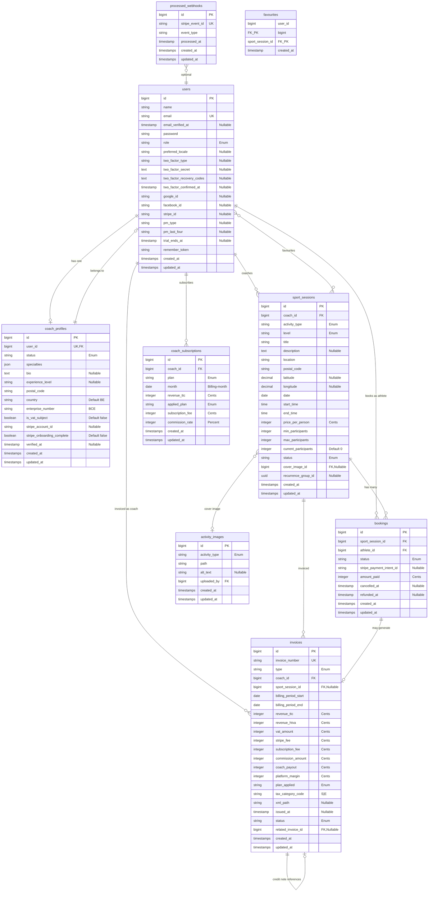
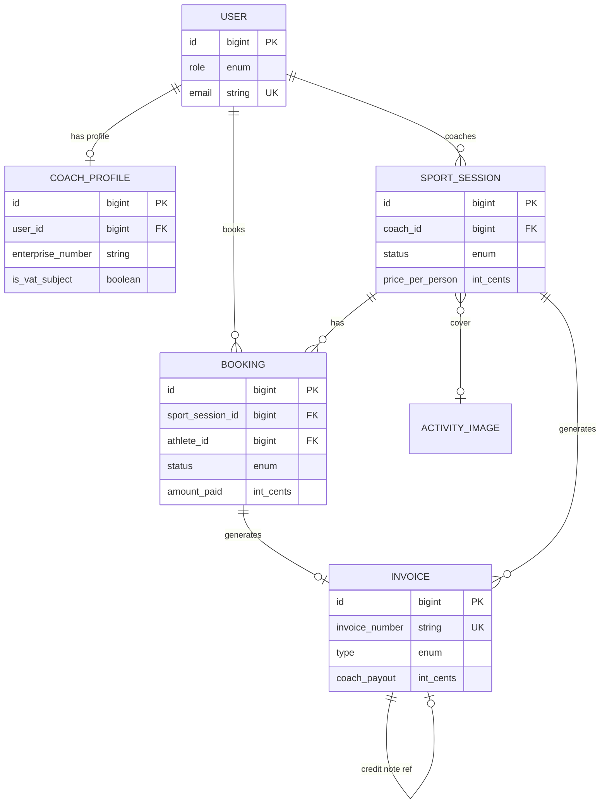
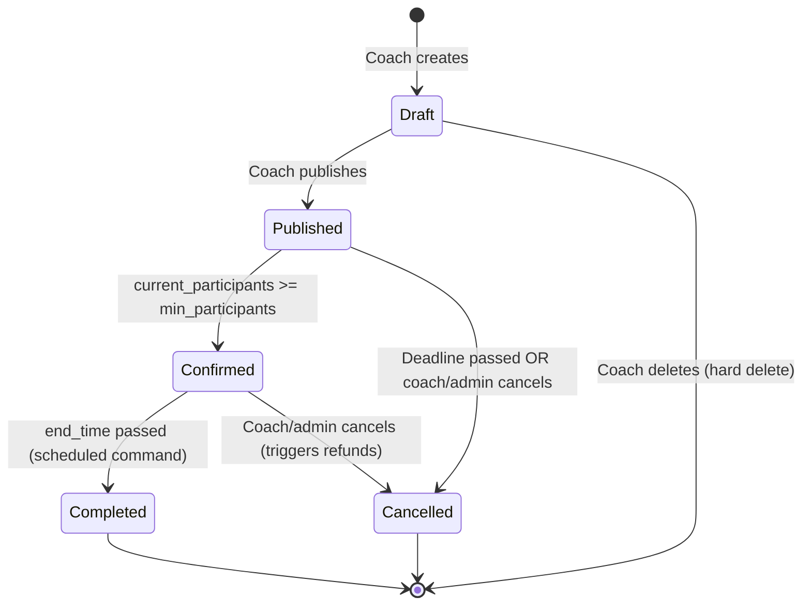
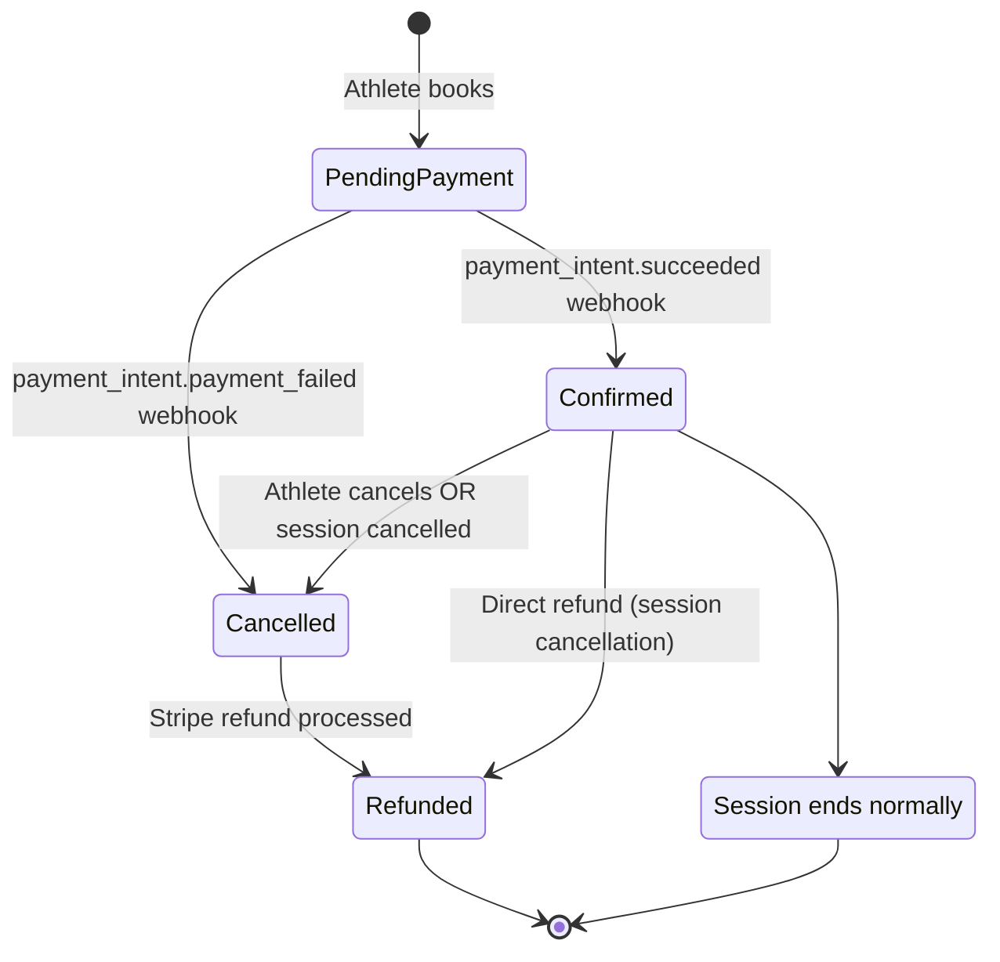
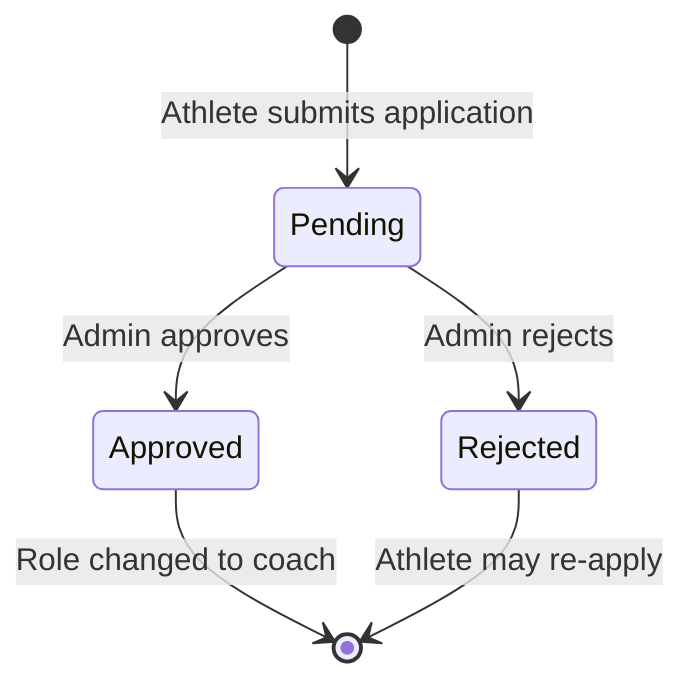

# Data Model

This document defines the canonical data model for Motivya. It is the single source of truth for database tables, columns, relationships, enums, and constraints. All migrations, models, and factories must conform to this specification.

> **Notation**: All monetary amounts are **integers in cents** (EUR). `1250` = €12,50. See [Decisions.md](Decisions.md) ADR-010.

---

## Entity Relationship Diagram

### Full ERD



### Core Domain (simplified view)



---

## State Machines

### Session Lifecycle



### Booking Lifecycle



### Coach Application Lifecycle



---

## Tables

### `users`

The central identity table. One user = one role. Extended with Fortify 2FA columns, Cashier billing columns, and OAuth provider IDs.

| Column | Type | Nullable | Default | Constraints | Notes |
|--------|------|----------|---------|------------|-------|
| `id` | `bigint unsigned` | No | auto | PK | |
| `name` | `string(255)` | No | — | | |
| `email` | `string(255)` | No | — | Unique | |
| `email_verified_at` | `timestamp` | Yes | `null` | | |
| `password` | `string(255)` | No | — | | Hashed (bcrypt) |
| `role` | `string(20)` | No | `'athlete'` | | Values: `coach`, `athlete`, `accountant`, `admin` |
| `preferred_locale` | `string(2)` | Yes | `null` | | Values: `fr`, `en`, `nl`. Null = detect from browser |
| `two_factor_type` | `string(10)` | Yes | `null` | | Values: `totp`, `email`. Null = 2FA disabled |
| `two_factor_secret` | `text` | Yes | `null` | | Encrypted TOTP secret (Fortify) |
| `two_factor_recovery_codes` | `text` | Yes | `null` | | Encrypted JSON array (Fortify) |
| `two_factor_confirmed_at` | `timestamp` | Yes | `null` | | When user confirmed 2FA setup (Fortify) |
| `google_id` | `string(255)` | Yes | `null` | Index | Google OAuth subject ID |
| `facebook_id` | `string(255)` | Yes | `null` | Index | Facebook OAuth user ID |
| `stripe_id` | `string(255)` | Yes | `null` | Index | Stripe customer ID (Cashier) |
| `pm_type` | `string(255)` | Yes | `null` | | Payment method type (Cashier) |
| `pm_last_four` | `string(4)` | Yes | `null` | | Last 4 digits of card (Cashier) |
| `trial_ends_at` | `timestamp` | Yes | `null` | | Cashier trial |
| `remember_token` | `string(100)` | Yes | `null` | | Laravel remember me |
| `created_at` | `timestamp` | Yes | `null` | | |
| `updated_at` | `timestamp` | Yes | `null` | | |

**Indexes**: `email` (unique), `google_id`, `facebook_id`, `stripe_id`, `role`

**Cast**: `role` → `UserRole` enum, `email_verified_at` → `datetime`, `two_factor_type` → `TwoFactorMethod` enum, `password` → `hashed`

---

### `coach_profiles`

Coach-specific professional information. One-to-one with `users`. Created when an athlete applies to become a coach.

| Column | Type | Nullable | Default | Constraints | Notes |
|--------|------|----------|---------|------------|-------|
| `id` | `bigint unsigned` | No | auto | PK | |
| `user_id` | `bigint unsigned` | No | — | FK → `users.id`, Unique | One profile per user |
| `status` | `string(20)` | No | `'pending'` | | Values: `pending`, `approved`, `rejected` |
| `specialties` | `json` | No | `'[]'` | | Array of specialty strings |
| `bio` | `text` | Yes | `null` | | Free-text coach biography |
| `experience_level` | `string(50)` | Yes | `null` | | Self-reported experience |
| `postal_code` | `string(10)` | No | — | | Coach's primary zone |
| `country` | `string(2)` | No | `'BE'` | | ISO 3166-1 alpha-2 |
| `enterprise_number` | `string(15)` | No | — | | Belgian BCE/KBO `0XXX.XXX.XXX` |
| `is_vat_subject` | `boolean` | No | `false` | | VAT-subject vs franchise regime |
| `stripe_account_id` | `string(255)` | Yes | `null` | Index | Stripe Express `acct_…` |
| `stripe_onboarding_complete` | `boolean` | No | `false` | | True when Stripe details_submitted & charges_enabled |
| `verified_at` | `timestamp` | Yes | `null` | | When admin approved |
| `rejection_reason` | `text` | Yes | `null` | | Admin's rejection explanation |
| `created_at` | `timestamp` | Yes | `null` | | |
| `updated_at` | `timestamp` | Yes | `null` | | |

**Indexes**: `user_id` (unique), `status`, `stripe_account_id`

**Cast**: `specialties` → `array`, `is_vat_subject` → `boolean`, `stripe_onboarding_complete` → `boolean`, `verified_at` → `datetime`

**Relationships**:
- `belongsTo(User)` via `user_id`

---

### `sport_sessions`

A scheduled sports activity created by a coach. Named `sport_sessions` to avoid collision with Laravel's HTTP `sessions` table.

| Column | Type | Nullable | Default | Constraints | Notes |
|--------|------|----------|---------|------------|-------|
| `id` | `bigint unsigned` | No | auto | PK | |
| `coach_id` | `bigint unsigned` | No | — | FK → `users.id` | Must be a user with role `coach` |
| `activity_type` | `string(50)` | No | — | | `ActivityType` enum value |
| `level` | `string(20)` | No | — | | Values: `beginner`, `intermediate`, `advanced` |
| `title` | `string(255)` | No | — | | |
| `description` | `text` | Yes | `null` | | |
| `location` | `string(255)` | No | — | | Address or venue name |
| `postal_code` | `string(10)` | No | — | | Belgian 4-digit code for geo-filtering |
| `latitude` | `decimal(10,7)` | Yes | `null` | | For map display + Haversine distance |
| `longitude` | `decimal(10,7)` | Yes | `null` | | For map display + Haversine distance |
| `date` | `date` | No | — | | Must be future on creation |
| `start_time` | `time` | No | — | | |
| `end_time` | `time` | No | — | | Must be after `start_time` |
| `price_per_person` | `integer` | No | — | `> 0` | In **cents** (EUR) |
| `min_participants` | `integer` | No | — | `>= 1` | Threshold for confirmation |
| `max_participants` | `integer` | No | — | `>= min_participants` | Hard cap |
| `current_participants` | `integer` | No | `0` | `>= 0` | Maintained atomically via `lockForUpdate` |
| `status` | `string(20)` | No | `'draft'` | | Values: `draft`, `published`, `confirmed`, `completed`, `cancelled` |
| `cover_image_id` | `bigint unsigned` | Yes | `null` | FK → `activity_images.id` | Admin-uploaded image |
| `recurrence_group_id` | `uuid` | Yes | `null` | | Links recurring session instances |
| `created_at` | `timestamp` | Yes | `null` | | |
| `updated_at` | `timestamp` | Yes | `null` | | |

**Indexes**: `coach_id`, `status`, `date`, `postal_code`, `(latitude, longitude)` (composite), `recurrence_group_id`, `cover_image_id`

**Cast**: `activity_type` → `ActivityType` enum, `level` → `SessionLevel` enum, `status` → `SessionStatus` enum, `date` → `date`, `price_per_person` → `integer`, `latitude` → `decimal`, `longitude` → `decimal`

**Relationships**:
- `belongsTo(User, 'coach_id')` — the coach who created it
- `hasMany(Booking)` via `sport_session_id`
- `belongsTo(ActivityImage, 'cover_image_id')` — nullable
- `hasMany(Invoice)` via `sport_session_id`

**Critical constraint**: `current_participants` must never exceed `max_participants`. Enforced at the application level via atomic booking transactions, not a DB check constraint (SQLite compatibility).

---

### `bookings`

A reservation linking an athlete to a sport session. Created during the booking flow, status updated via Stripe webhooks.

| Column | Type | Nullable | Default | Constraints | Notes |
|--------|------|----------|---------|------------|-------|
| `id` | `bigint unsigned` | No | auto | PK | |
| `sport_session_id` | `bigint unsigned` | No | — | FK → `sport_sessions.id` | |
| `athlete_id` | `bigint unsigned` | No | — | FK → `users.id` | Must be an athlete |
| `status` | `string(20)` | No | `'pending_payment'` | | Values: `pending_payment`, `confirmed`, `cancelled`, `refunded` |
| `stripe_payment_intent_id` | `string(255)` | Yes | `null` | Index | Stripe `pi_…` |
| `amount_paid` | `integer` | No | `0` | | In **cents** (EUR), set on payment confirmation |
| `cancelled_at` | `timestamp` | Yes | `null` | | When booking was cancelled |
| `refunded_at` | `timestamp` | Yes | `null` | | When Stripe refund was processed |
| `created_at` | `timestamp` | Yes | `null` | | |
| `updated_at` | `timestamp` | Yes | `null` | | |

**Indexes**: `(sport_session_id, athlete_id)` (unique composite — one booking per athlete per session), `athlete_id`, `stripe_payment_intent_id`, `status`

**Cast**: `status` → `BookingStatus` enum, `amount_paid` → `integer`, `cancelled_at` → `datetime`, `refunded_at` → `datetime`

**Relationships**:
- `belongsTo(SportSession, 'sport_session_id')`
- `belongsTo(User, 'athlete_id')`

---

### `activity_images`

Admin-uploaded cover images for activity types. Coaches select from this library; they do not upload their own.

| Column | Type | Nullable | Default | Constraints | Notes |
|--------|------|----------|---------|------------|-------|
| `id` | `bigint unsigned` | No | auto | PK | |
| `activity_type` | `string(50)` | No | — | | `ActivityType` enum value |
| `path` | `string(255)` | No | — | | Storage path (local or S3) |
| `alt_text` | `string(255)` | Yes | `null` | | Accessibility text |
| `uploaded_by` | `bigint unsigned` | No | — | FK → `users.id` | Admin who uploaded |
| `created_at` | `timestamp` | Yes | `null` | | |
| `updated_at` | `timestamp` | Yes | `null` | | |

**Indexes**: `activity_type`, `uploaded_by`

**Cast**: `activity_type` → `ActivityType` enum

**Relationships**:
- `belongsTo(User, 'uploaded_by')`
- `hasMany(SportSession, 'cover_image_id')`

---

### `invoices`

Financial records for session-based and subscription invoices. Stores the full payout breakdown and references the generated PEPPOL XML.

| Column | Type | Nullable | Default | Constraints | Notes |
|--------|------|----------|---------|------------|-------|
| `id` | `bigint unsigned` | No | auto | PK | |
| `invoice_number` | `string(20)` | No | — | Unique | Format: `INV-YYYY-NNNNNN` or `CN-YYYY-NNNNNN` |
| `type` | `string(15)` | No | — | | Values: `invoice`, `credit_note` |
| `coach_id` | `bigint unsigned` | No | — | FK → `users.id` | |
| `sport_session_id` | `bigint unsigned` | Yes | `null` | FK → `sport_sessions.id` | Null for subscription-only invoices |
| `billing_period_start` | `date` | No | — | | |
| `billing_period_end` | `date` | No | — | | |
| `revenue_ttc` | `integer` | No | — | | Total athlete payments (cents) |
| `revenue_htva` | `integer` | No | — | | `revenue_ttc / 1.21` rounded |
| `vat_amount` | `integer` | No | — | | `revenue_ttc - revenue_htva` |
| `stripe_fee` | `integer` | No | `0` | | Stripe processing fees (cents) |
| `subscription_fee` | `integer` | No | `0` | | Monthly plan fee (cents, TTC) |
| `commission_amount` | `integer` | No | — | | Platform commission (cents, HTVA) |
| `coach_payout` | `integer` | No | — | | Amount owed to coach (cents, HTVA) |
| `platform_margin` | `integer` | No | — | | Net margin for Motivya (cents) |
| `plan_applied` | `string(10)` | No | — | | Values: `freemium`, `active`, `premium` |
| `tax_category_code` | `string(1)` | No | — | | `S` (standard 21%) or `E` (exempt) |
| `xml_path` | `string(255)` | Yes | `null` | | Path to PEPPOL XML file |
| `issued_at` | `timestamp` | Yes | `null` | | When invoice was finalized |
| `status` | `string(10)` | No | `'draft'` | | Values: `draft`, `issued`, `sent`, `paid` |
| `related_invoice_id` | `bigint unsigned` | Yes | `null` | FK → `invoices.id` | Credit note → original invoice |
| `created_at` | `timestamp` | Yes | `null` | | |
| `updated_at` | `timestamp` | Yes | `null` | | |

**Indexes**: `invoice_number` (unique), `coach_id`, `sport_session_id`, `status`, `type`, `related_invoice_id`, `billing_period_start`

**Cast**: `type` → `InvoiceType` enum, `status` → `InvoiceStatus` enum, `billing_period_start` → `date`, `billing_period_end` → `date`, `issued_at` → `datetime`

**Relationships**:
- `belongsTo(User, 'coach_id')`
- `belongsTo(SportSession, 'sport_session_id')` — nullable
- `belongsTo(Invoice, 'related_invoice_id')` — self-referential for credit notes

**Numbering**: Sequential with no gaps per year. `INV-2026-000001`, `INV-2026-000002`, … Credit notes: `CN-2026-000001`, …

---

### `coach_subscriptions`

Monthly billing cycle records. One row per coach per month, recording the auto-best-plan computation.

| Column | Type | Nullable | Default | Constraints | Notes |
|--------|------|----------|---------|------------|-------|
| `id` | `bigint unsigned` | No | auto | PK | |
| `coach_id` | `bigint unsigned` | No | — | FK → `users.id` | |
| `plan` | `string(10)` | No | — | | The coach's declared/default plan |
| `month` | `date` | No | — | | First day of the billing month |
| `revenue_ttc` | `integer` | No | `0` | | Total revenue for the month (cents) |
| `applied_plan` | `string(10)` | No | — | | Best plan computed by the system |
| `subscription_fee` | `integer` | No | `0` | | Fee for the applied plan (cents) |
| `commission_rate` | `integer` | No | — | | Percent (e.g., 30 for 30%) |
| `created_at` | `timestamp` | Yes | `null` | | |
| `updated_at` | `timestamp` | Yes | `null` | | |

**Indexes**: `(coach_id, month)` (unique composite — one record per coach per month), `coach_id`

**Cast**: `month` → `date`

**Relationships**:
- `belongsTo(User, 'coach_id')`

---

### `favourites` (pivot)

Athletes can favourite sport sessions. Many-to-many pivot table.

| Column | Type | Nullable | Default | Constraints | Notes |
|--------|------|----------|---------|------------|-------|
| `user_id` | `bigint unsigned` | No | — | FK → `users.id` | Composite PK |
| `sport_session_id` | `bigint unsigned` | No | — | FK → `sport_sessions.id` | Composite PK |
| `created_at` | `timestamp` | Yes | `null` | | |

**Indexes**: `(user_id, sport_session_id)` (primary composite)

---

### `processed_webhooks`

Idempotency table for Stripe webhook events. Prevents duplicate processing.

| Column | Type | Nullable | Default | Constraints | Notes |
|--------|------|----------|---------|------------|-------|
| `id` | `bigint unsigned` | No | auto | PK | |
| `stripe_event_id` | `string(255)` | No | — | Unique | Stripe event ID `evt_…` |
| `event_type` | `string(100)` | No | — | | e.g., `payment_intent.succeeded` |
| `processed_at` | `timestamp` | No | — | | When processing completed |
| `created_at` | `timestamp` | Yes | `null` | | |
| `updated_at` | `timestamp` | Yes | `null` | | |

**Indexes**: `stripe_event_id` (unique)

---

### Laravel-managed tables (not in domain ERD)

These tables exist but are managed by Laravel or packages. No custom model needed.

| Table | Managed by | Purpose |
|-------|-----------|---------|
| `sessions` | Laravel | HTTP session storage (database driver) |
| `password_reset_tokens` | Laravel | Password reset flow |
| `cache` | Laravel | Cache storage (database driver in dev) |
| `cache_locks` | Laravel | Cache lock mechanism |
| `jobs` | Laravel | Queue jobs |
| `job_batches` | Laravel | Batch job tracking |
| `failed_jobs` | Laravel | Failed queue jobs |
| `personal_access_tokens` | Sanctum | API tokens |
| `subscriptions` | Cashier | Stripe subscriptions (if used for recurring billing) |
| `subscription_items` | Cashier | Stripe subscription line items |

---

## Enums

All enums are backed PHP string enums in `app/Enums/`.

### `UserRole`

```
coach | athlete | accountant | admin
```

Default for new users: `athlete`. Cast on `users.role`.

### `TwoFactorMethod`

```
totp | email
```

Nullable — `null` means 2FA is disabled. Cast on `users.two_factor_type`.

### `CoachProfileStatus`

```
pending | approved | rejected
```

Cast on `coach_profiles.status`.

### `SessionStatus`

```
draft | published | confirmed | completed | cancelled
```

See State Machines section above for allowed transitions. Cast on `sport_sessions.status`.

### `SessionLevel`

```
beginner | intermediate | advanced
```

Cast on `sport_sessions.level`.

### `ActivityType`

```
yoga | strength | running | cardio | pilates | outdoor | boxing | dance | padel | tennis
```

Extensible by admin (future migration). Cast on `sport_sessions.activity_type` and `activity_images.activity_type`.

### `BookingStatus`

```
pending_payment | confirmed | cancelled | refunded
```

See State Machines section above. Cast on `bookings.status`.

### `InvoiceType`

```
invoice | credit_note
```

Cast on `invoices.type`.

### `InvoiceStatus`

```
draft | issued | sent | paid
```

Cast on `invoices.status`.

### `SubscriptionPlan`

```
freemium | active | premium
```

| Plan | Monthly fee (cents TTC) | Commission rate (%) |
|------|------------------------|-------------------|
| `freemium` | 0 | 30 |
| `active` | 3900 | 20 |
| `premium` | 7900 | 10 |

Cast on `coach_subscriptions.plan` and `coach_subscriptions.applied_plan`, and `invoices.plan_applied`.

---

## Relationship Summary

| From | Relationship | To | FK | Notes |
|------|-------------|-----|-----|-------|
| `User` | hasOne | `CoachProfile` | `coach_profiles.user_id` | Only if role is coach/pending |
| `User` | hasMany | `SportSession` | `sport_sessions.coach_id` | As coach |
| `User` | hasMany | `Booking` | `bookings.athlete_id` | As athlete |
| `User` | hasMany | `Invoice` | `invoices.coach_id` | As coach |
| `User` | hasMany | `CoachSubscription` | `coach_subscriptions.coach_id` | As coach |
| `User` | belongsToMany | `SportSession` | `favourites` pivot | As athlete |
| `SportSession` | belongsTo | `User` | `coach_id` | The coach |
| `SportSession` | hasMany | `Booking` | `sport_session_id` | |
| `SportSession` | belongsTo | `ActivityImage` | `cover_image_id` | Nullable |
| `SportSession` | hasMany | `Invoice` | `sport_session_id` | |
| `Booking` | belongsTo | `SportSession` | `sport_session_id` | |
| `Booking` | belongsTo | `User` | `athlete_id` | The athlete |
| `Invoice` | belongsTo | `User` | `coach_id` | The coach |
| `Invoice` | belongsTo | `SportSession` | `sport_session_id` | Nullable |
| `Invoice` | belongsTo | `Invoice` | `related_invoice_id` | Credit note → original |
| `CoachSubscription` | belongsTo | `User` | `coach_id` | |
| `ActivityImage` | belongsTo | `User` | `uploaded_by` | Admin |
| `ActivityImage` | hasMany | `SportSession` | `cover_image_id` | |

---

## Key Constraints

| Constraint | Table | Columns | Type |
|-----------|-------|---------|------|
| One booking per athlete per session | `bookings` | `(sport_session_id, athlete_id)` | Unique composite |
| One coach profile per user | `coach_profiles` | `user_id` | Unique |
| One subscription record per coach per month | `coach_subscriptions` | `(coach_id, month)` | Unique composite |
| Sequential invoice numbers | `invoices` | `invoice_number` | Unique |
| Webhook idempotency | `processed_webhooks` | `stripe_event_id` | Unique |
| Favourite uniqueness | `favourites` | `(user_id, sport_session_id)` | Primary composite |

---

## Migration Order

Migrations must be created in dependency order. Foreign keys require the referenced table to exist.

```
1. users                        (base, already exists)
2. password_reset_tokens        (already exists)
3. sessions (HTTP)              (already exists)
4. cache                        (already exists)
5. jobs                         (already exists)
6. -- New migrations below --
7. Add role, locale, 2FA, OAuth columns to users
8. coach_profiles               (FK → users)
9. activity_images              (FK → users)
10. sport_sessions              (FK → users, activity_images)
11. bookings                    (FK → sport_sessions, users)
12. invoices                    (FK → users, sport_sessions, self)
13. coach_subscriptions         (FK → users)
14. favourites                  (FK → users, sport_sessions)
15. processed_webhooks          (no FK)
16. personal_access_tokens      (Sanctum, FK → users)
17. Cashier tables              (Cashier migration)
```
